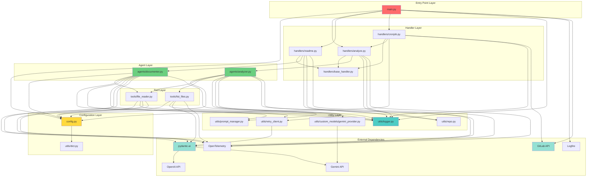

Now I have enough information to create a comprehensive dependency analysis. Let me compile the final document:

# Dependency Analysis

## Internal Dependencies Map

### Module Dependency Hierarchy

The project follows a clean layered architecture with well-defined dependency flows:

**Layer 1: Entry Point**
- `src/main.py` - Application entry point and CLI orchestration
  - Depends on: `config`, `handlers.*`, `utils.Logger`
  - External: `argparse`, `asyncio`, `logging`, `pathlib`, `logfire`, `nest_asyncio`, `gitlab`, `pydantic`

**Layer 2: Configuration Management**
- `src/config.py` - Multi-source configuration loading and merging
  - Depends on: `utils.dict.merge_dicts`
  - External: `yaml`, `dotenv`, `pydantic`
  - Provides: Global configuration constants and loading functions

**Layer 3: Handler Layer**
- `src/handlers/base_handler.py` - Abstract base handler with config path resolution
  - Depends on: `pydantic` only
  - Provides: `AbstractHandler`, `BaseHandlerConfig`

- `src/handlers/analyze.py` - Analysis orchestration handler
  - Depends on: `agents.analyzer`, `utils.repo`, `utils.Logger`, `base_handler`
  - External: `opentelemetry.trace`

- `src/handlers/readme.py` - Documentation generation handler
  - Depends on: `agents.documenter`, `utils.repo`, `utils.Logger`, `base_handler`
  - External: `opentelemetry.trace`

- `src/handlers/cronjob.py` - Automated GitLab project analysis
  - Depends on: `config`, `handlers.analyze`, `utils.*`, `base_handler`
  - External: `git.Repo`, `gitlab`, `shutil`, `datetime`

**Layer 4: Agent Layer**
- `src/agents/analyzer.py` - Multi-agent code analysis coordinator
  - Depends on: `config`, `utils.*`, `agents.tools.*`
  - External: `pydantic_ai`, `opentelemetry`, `asyncio`, `time`
  - Manages: 5 concurrent specialized analyzer agents

- `src/agents/documenter.py` - README generation agent
  - Depends on: `config`, `utils.*`, `agents.tools.FileReadTool`
  - External: `pydantic_ai`, `opentelemetry`, `time`

**Layer 5: Tool Layer**
- `src/agents/tools/file_tool/file_reader.py` - File content reading tool
  - Depends on: `config`, `utils.Logger`
  - External: `pydantic_ai.Tool`, `opentelemetry.trace`

- `src/agents/tools/dir_tool/list_files.py` - Directory traversal tool
  - Depends on: `config`, `utils.Logger`
  - External: `pydantic_ai.Tool`, `opentelemetry.trace`
  - Features: 200+ ignored directories/extensions for filtering

**Layer 6: Utility Layer**
- `src/utils/logger.py` - Centralized structured logging
  - Dependencies: None (pure utility)
  - External: `logging`, `ujson`, `pathlib`, `datetime`

- `src/utils/prompt_manager.py` - YAML-based prompt template management
  - Dependencies: None
  - External: `jinja2`, `yaml`, `pathlib`

- `src/utils/retry_client.py` - HTTP client with retry logic
  - Dependencies: None
  - External: `httpx`, `tenacity`, `pydantic_ai.retries`

- `src/utils/repo.py` - Git repository metadata extraction
  - Dependencies: None
  - External: `git.Repo` (GitPython), `subprocess`, `pathlib`

- `src/utils/dict.py` - Dictionary merging utilities
  - Dependencies: None (pure utility)

- `src/utils/custom_models/gemini_provider.py` - Custom Gemini AI provider
  - Dependencies: None
  - External: `pydantic_ai.providers.google_gla`

### Dependency Flow Diagram

```
main.py
  ├─→ config.py ──→ utils.dict
  ├─→ handlers/
  │     ├─→ base_handler.py
  │     ├─→ analyze.py ──→ agents.analyzer
  │     ├─→ readme.py ──→ agents.documenter
  │     └─→ cronjob.py ──→ handlers.analyze
  │
  └─→ agents/
        ├─→ analyzer.py ──→ tools/* ──→ utils/*
        └─→ documenter.py ──→ tools/file_reader ──→ utils/*

utils/ (shared across all layers)
  ├─→ logger.py (no internal deps)
  ├─→ prompt_manager.py (no internal deps)
  ├─→ retry_client.py (no internal deps)
  ├─→ repo.py (no internal deps)
  ├─→ dict.py (no internal deps)
  └─→ custom_models/gemini_provider.py (no internal deps)
```

### Circular Dependency Analysis

**No circular dependencies detected** - The architecture maintains strict layering:
- Lower layers (utils) have zero internal dependencies
- Middle layers (agents, tools) depend only on utils and config
- Upper layers (handlers) depend on agents and utils
- Entry point (main) depends on all layers but nothing depends on it

## External Libraries Analysis

### Core Dependencies (from pyproject.toml)

**AI/ML Framework**
- `pydantic-ai==1.0.15` - Core AI agent framework
  - Purpose: Multi-agent orchestration, tool integration, LLM abstraction
  - Usage: All agent implementations, tool definitions, model providers
  - Critical dependency: Entire agent system built on this framework

**Data Validation & Serialization**
- `pydantic==2.12.0` - Data validation and settings management
  - Purpose: Configuration models, type safety, validation
  - Usage: All configuration classes, agent inputs/outputs
  - Critical dependency: Used throughout entire codebase

- `ujson==5.11.0` - Fast JSON parsing
  - Purpose: High-performance JSON serialization for logging
  - Usage: Logger module for structured data logging

**Template Engine**
- `jinja2==3.1.6` - Template rendering
  - Purpose: Prompt template management and rendering
  - Usage: PromptManager for dynamic prompt generation

**Async Support**
- `nest-asyncio==1.6.0` - Nested event loop support
  - Purpose: Enable nested async operations
  - Usage: Applied globally in main.py for compatibility

**Git Integration**
- `gitpython==3.1.45` - Git repository operations
  - Purpose: Repository cloning, branch management, commits
  - Usage: Cronjob handler, repository version detection

- `python-gitlab==6.2.0` - GitLab API client
  - Purpose: Project discovery, MR creation, branch operations
  - Usage: Cronjob handler for automated analysis

**Observability**
- `logfire==4.12.0` - Observability and logging platform
  - Purpose: LLM monitoring, distributed tracing, instrumentation
  - Usage: Main entry point for pydantic-ai and httpx instrumentation

- `opentelemetry-instrumentation-httpx==0.58b0` - HTTP request tracing
  - Purpose: Automatic HTTP request/response tracing
  - Usage: Integrated with logfire for observability

**Configuration**
- `pyyaml>=6.0.2` - YAML parsing
  - Purpose: Configuration file loading, prompt template storage
  - Usage: Config module, PromptManager

- `python-dotenv>=1.1.1` - Environment variable loading
  - Purpose: .env file support for configuration
  - Usage: Config module initialization

### Transitive Dependencies (Key ones from uv.lock)

**AI Model Providers**
- `anthropic==0.69.0` - Claude AI models
  - Transitive via: pydantic-ai
  - Purpose: Alternative LLM provider support

- `openai` - OpenAI models (GPT-4, etc.)
  - Transitive via: pydantic-ai
  - Purpose: Primary LLM provider

- `google-genai==1.41.0` - Gemini models
  - Transitive via: pydantic-ai
  - Purpose: Google AI model support with custom provider

- `cohere==5.18.0` - Cohere models
  - Transitive via: pydantic-ai
  - Purpose: Additional LLM provider option

**HTTP & Networking**
- `httpx` - Async HTTP client
  - Transitive via: pydantic-ai, anthropic, openai
  - Purpose: LLM API communication, retry logic
  - Custom usage: retry_client.py with tenacity integration

- `aiohttp==3.12.15` - Async HTTP client/server
  - Transitive via: multiple dependencies
  - Purpose: Alternative async HTTP implementation

- `tenacity` - Retry library
  - Transitive via: pydantic-ai
  - Purpose: Exponential backoff, retry logic
  - Custom usage: retry_client.py for HTTP resilience

**Observability Stack**
- `opentelemetry-api` - Tracing API
  - Transitive via: logfire
  - Purpose: Distributed tracing, span management
  - Direct usage: agents and tools for span creation

- `opentelemetry-instrumentation-httpx==0.58b0` - HTTP instrumentation
  - Direct dependency
  - Purpose: Automatic HTTP request tracing

**Data Processing**
- `jinja2==3.1.6` - Template engine
  - Direct dependency
  - Purpose: Prompt template rendering

- `pyyaml>=6.0.2` - YAML parser
  - Direct dependency
  - Purpose: Configuration and prompt file parsing

**Authentication & Security**
- `google-auth==2.40.3` - Google authentication
  - Transitive via: google-genai
  - Purpose: Gemini API authentication

**Development Tools**
- `ipython>=9.6.0` - Interactive Python shell (dev)
  - Purpose: Development and debugging

- `ruff>=0.14.0` - Python linter and formatter (dev)
  - Purpose: Code quality and formatting

### Version Pinning Strategy

**Exact Pinning (High Risk)**
- Most dependencies use exact versions (e.g., `pydantic==2.12.0`)
- Risk: No automatic security updates or bug fixes
- Rationale: Ensures reproducible builds and prevents breaking changes

**Range Pinning (Flexible)**
- `pyyaml>=6.0.2` - Allows minor/patch updates
- `python-dotenv>=1.1.1` - Allows minor/patch updates
- Rationale: These are stable libraries with good backward compatibility

**Development Dependencies**
- `ipython>=9.6.0` - Flexible versioning for dev tools
- `ruff>=0.14.0` - Allows updates for latest features

## Service Integrations

### AI Model Provider Integrations

**OpenAI Integration**
- **Configuration**: `ANALYZER_LLM_MODEL`, `DOCUMENTER_LLM_MODEL`, `*_LLM_BASE_URL`, `*_LLM_API_KEY`
- **Provider**: `OpenAIProvider` from pydantic-ai
- **Models Supported**: GPT-4, GPT-3.5-turbo, custom OpenAI-compatible endpoints
- **Usage Pattern**: 
  - Model instantiation: `OpenAIModel(model_name, provider=OpenAIProvider(...))`
  - Custom HTTP client with retry logic via `create_retrying_client()`
  - Settings: temperature, max_tokens, timeout, parallel_tool_calls
- **Integration Points**: 
  - `analyzer.py`: 5 concurrent agents for code analysis
  - `documenter.py`: Single agent for README generation

**Gemini Integration**
- **Configuration**: Model name contains "gemini", custom base URL support
- **Provider**: `CustomGeminiGLA` (custom implementation extending `GoogleGLAProvider`)
- **Custom Features**: 
  - Overrides base_url property for custom endpoints
  - Maintains compatibility with pydantic-ai framework
- **Usage Pattern**: `GeminiModel(model_name, provider=CustomGeminiGLA(...))`
- **Integration Points**: Same as OpenAI (analyzer and documenter agents)

**Anthropic/Claude Integration**
- **Support**: Via pydantic-ai framework (transitive dependency)
- **Configuration**: Through environment variables
- **Usage**: Available but not explicitly configured in current codebase

**Model Settings Configuration**
- **Analyzer Settings**:
  - Retries: `ANALYZER_AGENT_RETRIES` (default: 2)
  - Timeout: `ANALYZER_LLM_TIMEOUT` (default: 180s)
  - Max tokens: `ANALYZER_LLM_MAX_TOKENS` (default: 8192)
  - Temperature: `ANALYZER_LLM_TEMPERATURE` (default: 0.0)
  - Parallel tool calls: `ANALYZER_PARALLEL_TOOL_CALLS` (default: true)

- **Documenter Settings**:
  - Retries: `DOCUMENTER_AGENT_RETRIES` (default: 2)
  - Timeout: `DOCUMENTER_LLM_TIMEOUT` (default: 180s)
  - Max tokens: `DOCUMENTER_LLM_MAX_TOKENS` (default: 8192)
  - Temperature: `DOCUMENTER_LLM_TEMPERATURE` (default: 0.0)
  - Parallel tool calls: `DOCUMENTER_PARALLEL_TOOL_CALLS` (default: true)

### GitLab Integration

**API Client Configuration**
- **Library**: `python-gitlab==6.2.0`
- **Authentication**: OAuth token via `GITLAB_OAUTH_TOKEN`
- **Base URL**: `GITLAB_API_URL` (default: "https://git.divar.cloud")
- **User Configuration**:
  - Name: `GITLAB_USER_NAME` (default: "AI Analyzer")
  - Username: `GITLAB_USER_USERNAME` (default: "agent_doc")
  - Email: `GITLAB_USER_EMAIL`

**Integration Features**
- **Project Discovery**:
  - Group-based project listing with subgroup support
  - Iterator-based pagination for large groups
  - Project filtering by activity, commit history, archived status

- **Repository Operations**:
  - HTTP-based cloning with authentication
  - Branch creation with date-based naming
  - Git configuration (user.name, user.email)

- **Merge Request Automation**:
  - Automated MR creation with structured titles
  - Description includes analyzer version and metadata
  - Skip CI flag support (`[skip ci]`)
  - Duplicate MR prevention

- **Branch Management**:
  - Branch existence checking
  - Default branch detection
  - Commit message validation

**Cronjob Integration Pattern**
- **Project Filtering Logic**:
  - Exclude archived projects
  - Exclude specific subgroups (configurable list)
  - Exclude specific project IDs (configurable list)
  - Check last commit date (configurable threshold)
  - Prevent duplicate analysis (check for existing MRs)

- **Execution Flow**:
  1. Discover projects in GitLab group
  2. Filter applicable projects
  3. Clone repository to working directory
  4. Run analysis handler
  5. Create branch and commit changes
  6. Create merge request
  7. Cleanup working directory

### Observability Service Integrations

**Logfire Integration**
- **Configuration**: 
  - Service name: "ai-doc-gen"
  - Environment: `ENVIRONMENT` (default: "development")
  - Send to Logfire: false (local-only mode)
- **Instrumentation**:
  - `logfire.instrument_pydantic_ai()` - Automatic pydantic-ai tracing
  - `logfire.instrument_httpx(capture_all=True)` - HTTP request/response capture
- **Usage**: Configured in `main.py` via `configure_langfuse()`

**Langfuse Integration (Optional)**
- **Configuration**:
  - Enable flag: `ENABLE_LANGFUSE` (default: false)
  - Public key: `LANGFUSE_PUBLIC_KEY`
  - Secret key: `LANGFUSE_SECRET_KEY`
- **Authentication**: Basic auth via OTLP headers
- **Purpose**: LLM observability and analytics
- **Integration**: Via OpenTelemetry OTLP exporter

**OpenTelemetry Tracing**
- **Direct Usage**:
  - `trace.get_tracer()` - Create named tracers for components
  - `start_as_current_span()` - Create spans for operations
  - `span.set_attributes()` - Add metadata to spans
  - `span.add_event()` - Log events within spans
- **Traced Components**:
  - Analyzer handler: Repository path, version, exclusion flags
  - Documenter handler: Repository path, version
  - Individual agents: Agent name, execution events
  - Tools: Input/output attributes

### HTTP Retry Integration

**Retry Client Configuration**
- **Library**: `httpx` with `tenacity` for retry logic
- **Implementation**: `create_retrying_client()` in `retry_client.py`
- **Retry Strategy**:
  - Max attempts: `HTTP_RETRY_MAX_ATTEMPTS` (default: 5)
  - Multiplier: `HTTP_RETRY_MULTIPLIER` (default: 1)
  - Max wait per attempt: `HTTP_RETRY_MAX_WAIT_PER_ATTEMPT` (default: 60s)
  - Max total wait: `HTTP_RETRY_MAX_TOTAL_WAIT` (default: 300s)

**Retry Conditions**
- **Status Codes**: 429 (rate limit), 502, 503, 504 (server errors)
- **Exceptions**: HTTPStatusError, ConnectionError
- **Wait Strategy**:
  - Primary: Respect "Retry-After" header from server
  - Fallback: Exponential backoff (1s, 2s, 4s, 8s, ...)
  - Maximum: 60s between attempts, 300s total

**Integration Points**
- Used by all AI model providers (OpenAI, Gemini, Anthropic)
- Configured in agent initialization
- Shared across analyzer and documenter agents

## Dependency Injection Patterns

### Configuration-Driven Injection

The project uses **configuration-based dependency injection** without a traditional DI container:

**Multi-Source Configuration Pattern**
```python
# Precedence: defaults → file config → CLI args
def load_config(args, handler_config: Type[T], file_key: str = "") -> T:
    file_config = load_config_from_file(args, file_key)
    cli_config = load_config_as_dict(args, handler_config)
    config = merge_dicts(file_config, cli_config)
    return handler_config(**config)
```

**Handler Factory Pattern**
- Handlers instantiated with configuration objects
- Configuration contains all dependencies (paths, settings, flags)
- Example: `AnalyzeHandler(config: AnalyzeHandlerConfig)`

**Agent Configuration Injection**
- Agents receive configuration objects in constructor
- Configuration includes model settings, retry policies, tool configs
- Example: `AnalyzerAgent(cfg: AnalyzerAgentConfig)`

### Tool Registration Pattern

**Dynamic Tool Loading**
- Tools registered with pydantic-ai agents during initialization
- Configuration-based retry policies injected
- Example:
```python
Tool(
    self._run,
    name="Read-File",
    takes_ctx=False,
    max_retries=config.TOOL_FILE_READER_MAX_RETRIES
)
```

**Tool Configuration**
- File reader max retries: `TOOL_FILE_READER_MAX_RETRIES` (default: 2)
- List files max retries: `TOOL_LIST_FILES_MAX_RETRIES` (default: 2)
- Retry logic handled by pydantic-ai framework

### Model Provider Injection

**Provider Selection Pattern**
```python
if "gemini" in model_name:
    model = GeminiModel(
        model_name=model_name,
        provider=CustomGeminiGLA(
            api_key=api_key,
            base_url=base_url,
            http_client=retrying_http_client,
        ),
    )
else:
    model = OpenAIModel(
        model_name=model_name,
        provider=OpenAIProvider(
            base_url=base_url,
            api_key=api_key,
            http_client=retrying_http_client,
        ),
    )
```

**HTTP Client Injection**
- Retry client created once and injected into providers
- Shared configuration across all model providers
- Ensures consistent retry behavior

### Logging Injection

**Singleton Logger Pattern**
- Logger initialized once at application startup
- Class-level state maintained across application
- No explicit injection needed (global access via `Logger` class)
- Configuration: log directory, file level, console level

### Prompt Manager Injection

**File-Based Template Loading**
- PromptManager instantiated with YAML file path
- Templates loaded and cached at initialization
- Used by agents for dynamic prompt generation
- Example: `PromptManager(file_path=Path(__file__).parent / "prompts" / "analyzer.yaml")`

## Module Coupling Assessment

### Low Coupling Areas ✅

**Utility Modules (Excellent Isolation)**
- `utils/logger.py`: Zero internal dependencies, pure logging utility
- `utils/dict.py`: Pure functions for dictionary operations
- `utils/repo.py`: Single external dependency (GitPython), no internal deps
- `utils/retry_client.py`: Self-contained HTTP retry logic
- `utils/prompt_manager.py`: Isolated template management

**Benefits**:
- Highly testable in isolation
- Easy to replace or modify
- No ripple effects from changes
- Clear single responsibility

**Tool Layer (Good Isolation)**
- Clear interfaces through pydantic-ai Tool class
- Minimal dependencies (config, logging only)
- Easily testable and replaceable
- Well-defined input/output contracts

**Benefits**:
- Tools can be added/removed without affecting agents
- Easy to mock for testing
- Clear separation of concerns

### Medium Coupling Areas ⚠️

**Handler Layer (Moderate Coupling)**
- Handlers depend on specific agent implementations
- Configuration coupling through shared config classes
- Direct instantiation of agents (no interface abstraction)

**Issues**:
- Changing agent interfaces requires handler updates
- Testing requires mocking concrete agent classes
- Limited flexibility for agent substitution

**Recommendations**:
- Introduce agent interfaces/protocols
- Use factory pattern for agent creation
- Consider dependency injection for agents

**Agent Layer (Moderate Coupling)**
- Agents tightly coupled to specific tool implementations
- Direct dependency on configuration module
- Model provider coupling through pydantic-ai

**Issues**:
- Tool changes may require agent modifications
- Configuration changes ripple through agents
- Limited flexibility for tool substitution

**Recommendations**:
- Define tool interfaces separate from implementations
- Use dependency injection for tools
- Consider plugin architecture for extensibility

### High Coupling Areas ❌

**Main Entry Point (High Coupling)**
- Imports all handler types directly
- Tightly coupled to argument parsing structure
- Configuration loading logic embedded
- Direct instantiation of handlers

**Issues**:
- Adding new handlers requires main.py changes
- Testing requires complex setup
- Limited extensibility
- Violates Open/Closed Principle

**Recommendations**:
- Implement handler registry pattern
- Use plugin discovery mechanism
- Separate CLI parsing from handler execution
- Introduce command pattern with handler factory

**Configuration Module (High Coupling)**
- Global environment variable dependencies
- Mixed concerns (loading, validation, merging)
- Used throughout entire application
- Single point of failure

**Issues**:
- Changes affect entire application
- Difficult to test in isolation
- Global state management
- Tight coupling to environment

**Recommendations**:
- Separate configuration loading from validation
- Introduce configuration interfaces
- Use dependency injection for configuration
- Add configuration versioning

### Coupling Metrics

**Afferent Coupling (Ca) - Incoming Dependencies**
- `utils/*`: High (used by all layers) - Good for utilities
- `config.py`: High (used by all layers) - Concerning
- `agents/*`: Medium (used by handlers)
- `handlers/*`: Low (used only by main)

**Efferent Coupling (Ce) - Outgoing Dependencies**
- `main.py`: High (depends on all layers) - Expected for entry point
- `handlers/*`: Medium (depends on agents, utils)
- `agents/*`: Medium (depends on tools, utils)
- `utils/*`: Low (minimal dependencies) - Excellent

**Instability (I = Ce / (Ca + Ce))**
- `utils/*`: ~0.1 (very stable) - Excellent
- `agents/*`: ~0.4 (moderately stable) - Good
- `handlers/*`: ~0.6 (moderately unstable) - Acceptable
- `main.py`: ~0.9 (very unstable) - Expected for entry point

## Dependency Graph



### Critical Dependency Paths

**Path 1: Analysis Execution**
```
main.py → analyze.py → analyzer.py → tools → pydantic-ai → OpenAI/Gemini
```

**Path 2: Documentation Generation**
```
main.py → readme.py → documenter.py → file_tool → pydantic-ai → OpenAI/Gemini
```

**Path 3: Automated Cronjob**
```
main.py → cronjob.py → GitLab API → analyze.py → analyzer.py → pydantic-ai
```

**Path 4: Configuration Loading**
```
main.py → config.py → utils/dict → YAML files → Pydantic validation
```

**Path 5: Observability**
```
All components → OpenTelemetry → Logfire → (Optional) Langfuse
```

## Potential Dependency Issues

### Version Lock Risks ⚠️

**Exact Version Pinning**
- **Issue**: Most dependencies use exact versions (e.g., `pydantic==2.12.0`)
- **Risk**: Security updates and bug fixes not automatically received
- **Impact**: Potential security vulnerabilities, missing performance improvements
- **Affected Dependencies**: pydantic, jinja2, ujson, pydantic-ai, nest-asyncio, python-gitlab, gitpython, logfire
- **Recommendation**: 
  - Use compatible version ranges for stable libraries (e.g., `pydantic>=2.12.0,<3.0.0`)
  - Implement automated dependency update checks
  - Regular security audits with tools like `pip-audit`

**pydantic-ai Dependency**
- **Issue**: Version `1.0.15` is relatively new (1.x series)
- **Risk**: Breaking changes in minor/patch updates
- **Impact**: High - entire agent system built on this framework
- **Recommendation**: 
  - Pin to minor version range (e.g., `pydantic-ai>=1.0.15,<1.1.0`)
  - Monitor release notes closely
  - Maintain comprehensive integration tests
  - Consider version compatibility matrix

### Circular Dependency Risks 🔄

**Config-Utils Potential Circular Reference**
- **Current State**: `config.py` imports `utils.dict.merge_dicts`
- **Risk**: Utils modules may need config values in future
- **Impact**: Import errors, initialization failures
- **Mitigation**: Currently avoided through careful design
- **Recommendation**:
  - Keep utils completely independent of config
  - Use dependency injection for configuration needs
  - Document the no-config-in-utils rule

**No Actual Circular Dependencies Detected**
- Clean layered architecture prevents circular imports
- Strict dependency flow: main → handlers → agents → tools → utils
- Utils layer has zero internal dependencies

### Heavy Dependency Chain ⚙️

**AI Provider Dependencies**
- **Issue**: Multiple AI providers loaded even if unused (OpenAI, Anthropic, Google, Cohere)
- **Impact**: 
  - Large dependency footprint (~50+ transitive dependencies)
  - Increased installation time and disk space
  - Potential security surface area
- **Affected Packages**: anthropic, openai, google-genai, cohere (all via pydantic-ai)
- **Recommendation**:
  - Implement lazy loading for providers
  - Use optional dependencies: `pip install ai-doc-gen[openai]`
  - Consider provider-specific extras in pyproject.toml
  - Example:
    ```toml
    [project.optional-dependencies]
    openai = ["openai>=1.0.0"]
    anthropic = ["anthropic>=0.69.0"]
    gemini = ["google-genai>=1.41.0"]
    ```

**Observability Stack**
- **Issue**: Heavy observability dependencies (OpenTelemetry, Logfire)
- **Impact**: Required even for simple local usage
- **Recommendation**:
  - Make observability optional
  - Provide lightweight mode without tracing
  - Use conditional imports with graceful degradation

### Single Points of Failure 💥

**Configuration System**
- **Issue**: All components depend on centralized config module
- **Impact**: Failure in config loading affects entire application
- **Failure Scenarios**:
  - Missing environment variables
  -